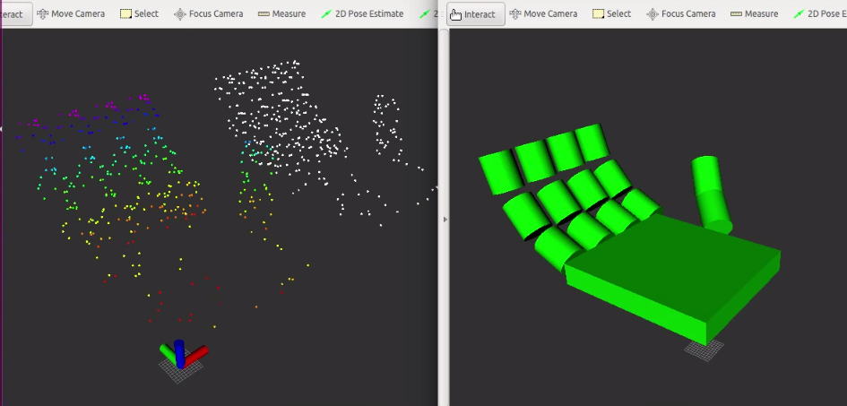

---
#
# Use the widgets beneath and the content will be
# inserted automagically in the webpage. To make
# this work, you have to use › layout: frontpage
#
layout: frontpage
title: "Xiongyi Cui's website – Make Things Work!"
header:
   image_fullwidth: "team_photo2.jpg"
widget-1:
    title: "Tech Blog"
    url: 'http://cuixiongyi.github.io/blog/'
    text: 'If we knew what it was we were doing, it wouldn&#39;t be called research, would it? &shy &shyAlbert Einstein'
    image: bonny.png
widget-2:
    title: "robot fall compilation from DARPA Robotic Challenge"
    url: 'https://www.youtube.com/watch?v=g0TaYhjpOfo'
    text: 'robot fall compilation from DARPA Robotic Challenge'
    video: ''
widget-3:
    title: "Primitive Hand Tracking"
    url: 'https://www.youtube.com/watch?v=ZcIvLRx9GuI'
    text: 'This is the summer project I did from July. It able to track articulated joints.'
    video: ''

---

  

    <iframe width="1280" height="720" src="https://www.youtube.com/watch?v=g0TaYhjpOfo" frameborder="0" allowfullscreen></iframe>
  

  <a class="close-reveal-modal">&#215;</a>

